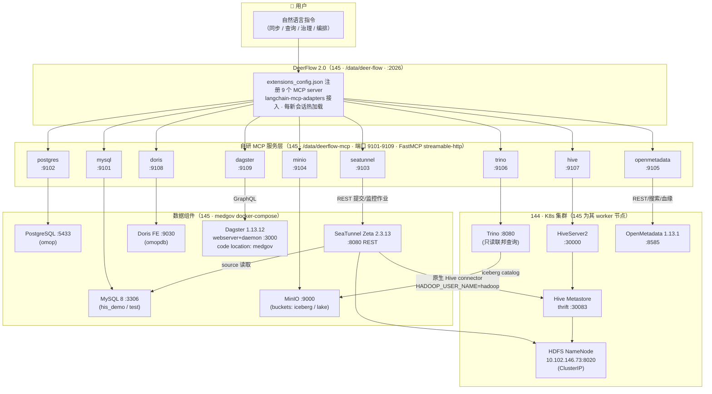

# AI Native 医疗数据治理平台 — DeerFlow + MCP 智能数据栈总览

> 项目目标：以 **DeerFlow（大模型 Agent 平台）+ MCP（Model Context Protocol）** 为智能入口，
> 用自然语言对话驱动底层数据组件，实现医疗数据（OMOP CDM）的同步、加工、查询、治理与编排。
>
> 环境：离线内网 10.131.102.144 / 10.131.102.145，Docker + K8s 混合部署。
> 最近更新：2026-09-03

---

## 1. 一句话架构

**用户一句话 → DeerFlow Agent 编排 → 9 个自研 MCP 工具服务（streamable-http）→ 数据同步（SeaTunnel）/ 存储（MySQL·PG·Hive·Doris·MinIO）/ 查询（Trino）/ 编排（Dagster）/ 治理（OpenMetadata）**

端到端已验证的代表性场景：对话发起「把 MySQL his_demo 的表同步到 Hive」→ Agent 查源表结构 → 建目标 Hive 表 → 提交 SeaTunnel 作业 → 校验数据落库，全程无需人工写 SQL 或脚本。

---

## 2. 总体架构图



---

## 3. 网络与部署拓扑（关键前提）

| 机器 | 角色 | 部署内容 |
|------|------|---------|
| **10.131.102.144**（ubuntn144） | K8s 控制面节点 | HiveServer2 / Metastore / HDFS / Trino / Nessie / OpenMetadata（docker：openmetadata-server/-ingestion/-mysql/-opensearch） |
| **10.131.102.145**（ubuntn145） | K8s **worker 节点** + Docker 数据栈 | DeerFlow、9 个 MCP 容器、medgov compose（MySQL/PG/SeaTunnel/MinIO/Doris/Dagster） |

**核心要点：145 本身就是 144 集群的 worker 节点**，flannel 路由使 145 上的 Docker 容器可直接访问全部 Pod IP（10.244.x.x）和 ClusterIP（经 kube-proxy DNAT），因此 SeaTunnel/MCP 访问 Hive、HDFS、Trino **无需暴露任何 NodePort**。HDFS NameNode 以 `extra_hosts: hadoop-master.hadoop.svc.cluster.local:10.102.146.73` 解析。

---

## 4. 自研 MCP 服务层（核心自研资产）

### 4.1 代码位置与结构

```
本地 Mac：/tmp/deerflow-mcp/          （开发）
服务器：  /data/deerflow-mcp/         （145，docker compose 运行）

db_common.py          共享库：SQL 只读正则校验、结果截断(200行)、JSON 序列化
db_mcp.py             通用 DB server：DB_TYPE 环境变量分派 mysql/pg/trino/hive 四种方言
seatunnel_mcp.py      SeaTunnel Zeta REST 封装（含密码占位符自动注入）
minio_mcp.py          MinIO S3 对象操作
openmetadata_mcp.py   元数据检索 / 表详情 / 血缘查询
dagster_mcp.py        GraphQL 封装：资产物化 / 作业启动 / 运行跟踪
Dockerfile            python:3.12-slim（离线环境用清华 pypi 源）
docker-compose.yml    9 个服务，端口 9101-9109
```

- **框架**：Python `mcp` SDK 的 `FastMCP`，**必须锁 `mcp>=1.2.0,<2.0.0`**（2.0 移除了模块路径）
- **传输**：`streamable-http`（常驻容器、路径 `/mcp`），DeerFlow 侧 `extensions_config.json` 填 `type: "http"` + url 即接入
- **注释规范**：代码注释 / docstring 一律中文，标识符保持英文
- **踩坑**：带 `.format()`/f-string 的 docstring 不是字面量，`__doc__` 为空导致工具描述丢失 —— 必须显式赋 `fn.__doc__` 再 `mcp.tool()(fn)` 注册

### 4.2 九个服务 × 工具清单

| MCP (端口) | 目标组件 | 工具 | 说明 |
|-----------|---------|------|------|
| mysql (9101) | MySQL 145:3306 | list_databases / list_tables / describe_table / read_query / execute_sql | 库 his_demo、test |
| postgres (9102) | PG 145:5433 | 同上 | 库 omop（OMOP CDM） |
| seatunnel (9103) | SeaTunnel 145:8080 | submit_job / stop_job / list_running_jobs / list_finished_jobs / get_job_info / cluster_monitoring | 作业配置规则内嵌在工具描述里（Hive 同步要点、密码占位符约定等） |
| minio (9104) | MinIO 145:9000 | list_buckets / list_objects / read_text_object / put_text_object / delete_object / presigned_url | 对象存储 / Iceberg 底座 |
| openmetadata (9105) | OM 144:8585 | search_metadata / get_table_details / get_lineage / list_database_services / list_tables | 登录自动 base64 编码密码并缓存 JWT |
| trino (9106) | Trino 144:8080 | list_databases(catalog) / list_tables / describe_table / read_query | **只读**（ALLOW_WRITE=false） |
| hive (9107) | HiveServer2 144:30000 | list_databases / list_tables / describe_table / read_query / execute_sql | impyla 驱动；库 default / omopdb / testdb |
| doris (9108) | Doris FE 145:9030 | 同 mysql | 走 MySQL 协议 |
| dagster (9109) | Dagster 145:3000 | dagster_overview / list_assets / list_runs / get_run_details / materialize_assets / launch_job / terminate_run / reload_workspace | GraphQL；资产物化经 `__ASSET_JOB` + `dagster/asset_selection` 标签 |

### 4.3 安全设计

- **凭据隔离**：真实密码只存在于 MCP 容器环境变量；Agent 生成的作业配置里一律写 `...` 占位符，由 seatunnel MCP 服务端自动注入（`_inject_credentials`）
- **只读硬校验**：`read_query` 用正则强制单条 SELECT/WITH/SHOW/EXPLAIN/DESCRIBE，多语句直接拒绝
- **写确认**：`execute_sql` 工具描述要求 Agent 必须先向用户展示 SQL 并获确认；`ALLOW_WRITE=false` 可整体关闭写能力
- **结果防爆**：查询结果统一截断 200 行

---

## 5. 数据同步能力（SeaTunnel，已验证）

### 5.1 已验证链路

| 链路 | 方式 | 状态 |
|------|------|------|
| MySQL → PostgreSQL | Jdbc source/sink，`schema_save_mode=CREATE_SCHEMA_WHEN_NOT_EXIST` 自动建表 | ✅ 端到端验证（含行数校验） |
| MySQL → Hive | **原生 Hive connector**（metastore_uri + table_name），直写 HDFS | ✅ 端到端验证 |
| MySQL → Console（冒烟） | FakeSource/Jdbc → Console | ✅ 常用验证手段 |

### 5.2 Hive 同步关键配置（踩坑结论）

1. sink 用 `plugin_name: "Hive"`，必需选项仅两个：`metastore_uri: thrift://10.131.102.144:30083` 和 `table_name: "库.表"`
2. 目标表**必须先建好**（hive MCP execute_sql，建议 TEXTFILE），connector 不自动建表
3. SeaTunnel 容器需 `HADOOP_USER_NAME=hadoop`（默认 root 无 HDFS 写权限）+ extra_hosts 解析 NameNode
4. **不要走 jdbc:hive2:// 的 Jdbc sink**：SeaTunnel 2.3.13 明确不支持 Hive JDBC sink（RowConverter 无条件抛异常，且 Hive 驱动无 addBatch 能力）
5. 重复同步为 append 语义（追加新数据文件）；全量重灌先 DROP 重建
6. PG 方言注意：sink 的 `database` 选项同时是 URL 库名和 SQL schema 前缀；重同步同一表前需先 DROP（2.3.13 catalog bug）

### 5.3 运维参数（2026-08-21 调优）

- `TZ=Asia/Shanghai`：修复 Create/Finish Time 与服务器差 8 小时（JVM 默认 UTC）
- `history-job-expire-minutes: 10080`：历史作业保留 7 天（默认 1 天自动清理），配置在 145 `config/seatunnel/seatunnel.yaml`

---

## 6. 治理与编排

### 6.1 OpenMetadata（144:8585，v1.13.1）

- 已接入 4 个数据库服务：hive-144 / mysql-145 / pg-145 / trino-145，共 201 张表
- 每个服务已部署 metadata / usage / lineage / profiler / autoClassification 采集管道（openmetadata-ingestion 容器，Airflow 调度，每周日 02:00 UTC）
- **血缘现状与规划**：查询日志解析型血缘目前 0 条边（引擎内无可解析 DML）。规划三层方案：
  1. **自动层**：seatunnel MCP 提交作业成功后自动调 `PUT /api/v1/lineage` 登记源→目标边（OM 对 SeaTunnel 无原生集成，引擎日志里看不到跨源同步）
  2. **对话层**：openmetadata MCP 增加 add_lineage / delete_lineage / list_lineage_gaps 工具，由 DeerFlow 对话式建边
  3. **智能层**：`add_lineage_from_sql`，输入 ETL SQL 自动解析建边
  - Hive 数仓分层（ODS/DWD/DWS/ADS）用 Tier 标签 / Glossary / Domain 表达（OM 血缘是表级/列级，无库-库边）

### 6.2 Dagster（145:3000，v1.13.12）

- medgov code location，webserver + daemon 部署
- dagster MCP 经 GraphQL 实现对话式物化资产、启动作业、查运行状态、终止运行
- 已验证：`materialize_assets(["..."], note=...)` → run SUCCESS，`deerflow/note` 标签可追溯

---

## 7. 已知限制与环境问题

| 问题 | 影响 | 状态 |
|------|------|------|
| Hive MR 查询报 "User: hadoop is not allowed to impersonate hadoop" | 144 侧 hadoop.proxyuser 未配置，复杂 MR 查询失败；简单 SELECT 正常 | 已知，需在 144 配 proxyuser |
| Trino iceberg catalog → Nessie (http://nessie:19120) 不可达 | Trino 查不了 iceberg 湖 | 待修（Nessie 容器在 144 运行中） |
| Doris BE 曾因 CPU 缺 AVX2 掉线 | FE 的 DDL/列表可用，表查询可能失败 | 曾重启恢复，需观察 |
| SeaTunnel PG 重同步 | 报 table already exists（2.3.13 bug） | 规避：先 DROP 再同步 |
| OM 查询日志血缘为空 | 引擎内无 DML 历史 | 规划中（见 6.1） |
| MCP read_query 200 行截断 | 大结果集不完整 | 设计如此，导出走对象存储 |

---

## 8. 本目录文档导航

| 文档 | 内容 |
|------|------|
| [deerflow-mcp-datasync.md](deerflow-mcp-datasync.md) | **主力开发记录**：MCP 开发全过程、E2E 验证、Hive 同步排障（附录二）、Dagster 接入（附录三） |
| [144_145环境信息.md](144_145环境信息.md) | 服务器环境、账号、访问方式 |
| [大模型数据治理平台-共享信息.md](大模型数据治理平台-共享信息.md) | 共享凭据（密码占位符的真实值见此） |
| [《AI Native 医疗数据治理平台（OMOP CDM）架构与需求规格书》.md](《AI Native 医疗数据治理平台（OMOP CDM）架构与需求规格书》.md) | 平台需求规格 |
| [docker-deployment/](docker-deployment/) | medgov 平台 compose 部署文件与说明 |
| [iceberg/](iceberg/) | Iceberg 湖格式相关 |
| [omop-platform/](omop-platform/) | OMOP CDM 平台早期资料 |
| [datahub-deployment-guide.md](datahub-deployment-guide.md) | 早期 DataHub 方案（已被 OpenMetadata 取代） |

---

## 9. 快速上手（常用操作）

```bash
# ── 在 145 上 ──────────────────────────────────────────────
# 查看全部 MCP 容器状态
docker ps --format '{{.Names}}\t{{.Ports}}' | grep deerflow-mcp

# 重启某个 MCP（改代码后重建）
cd /data/deerflow-mcp && docker compose build mcp-mysql && docker compose up -d mcp-mysql

# DeerFlow 接入新 MCP：编辑 /data/deer-flow/extensions_config.json
# （工具描述按会话快照，改完需要新开会话生效）

# SeaTunnel 常用 REST
curl http://10.131.102.145:8080/running-jobs
curl http://10.131.102.145:8080/finished-jobs

# OpenMetadata 登录（密码需 base64）
curl -X POST http://10.131.102.144:8585/api/v1/users/login \
  -H 'Content-Type: application/json' \
  -d '{"email":"admin@open-metadata.org","password":"<base64>"}'

# medgov 数据栈整体操作（145）
cd /opt/ai-native-medical-data-governance-platform-docker
docker compose -f docker-compose.yml -f compose/lake.yml -f compose/compute.yml \
  -f compose/metadata.yml -f compose/orchestration.yml -f compose/ai.yml \
  -f compose/poc.yml --profile compute up -d <service>
```
